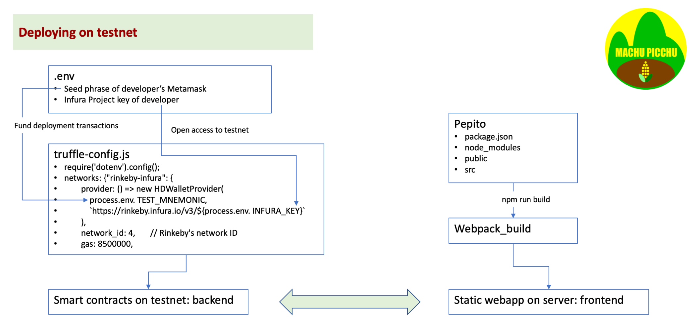

# Public Testnet Deployment Notes
[<-- Installation instructions](./README.md)

[<-- Design Notes](./Design%20notes.md)

The following notes collect some information that were not in the ConsenSys Academy Course but are useful to deploy Pepito on a public testnet and using a public web server.

## Overall explanation of public deployement 
### Coding changes
The React code is not modified. It is agnostic of the blockchain network and relies on the user to select the testnet and the paying account. 


### Backend
On the backend side, the secret information of the developer (`.env`) is not recorded in the git. It is only used by `truffle` to pay the migration fees on the selected testnet, using the Infura services through the Infura Project key.


### Frontend
On the frontend, which is a React application, running `npm build` calls a script that uses `webpack` to build an optimised static web application that can be served by a cloud service like _Netlify_ or an IPFS hoster like _Fleek_. It doesn't access to the secret developer information, so the secret is safe.

## Deployment in practice
### Correct version of `@truffle/hswallet-provider`
As of April 2021, the version of `@truffle/hadwallet-provider` that is compatible with the `truffle-config.js` of `truffle@5.1.46` is 1.2.3. 

If a higher version is used (for example 1.2.5) `truffle migrate` fails with the following message
```
   Deploying 'Migrations'
   ----------------------
Error:  *** Deployment Failed ***

"Migrations" -- transaction could not be decoded: unsigned transactions not supported.

Truffle v5.1.46 (core: 5.1.46)
Node v12.18.4

```

To change version, do the following
```
npm uninstall @truffle/hswallet-provider
npm install @truffle/hswallet-provider@1.2.3
```

### Changes in `.env`
```
TEST_MNEMONIC=<12-word seed phrase of developer's Metamask>
INFURA_KEY=<Infura Project Key of developer>
```
### Changes in `truffle-config.js`
```
    networks: {
        "rinkeby-infura": {
        provider: () => new HDWalletProvider(
            process.env.TEST_MNEMONIC,
            `https://rinkeby.infura.io/v3/${process.env.INFURA_KEY}`
        ),
        network_id: 4,       // Rinkeby's network ID
        gas: 8500000,
    },
...
```
Note: the `value` part of the key `provider` is wrapped in an anonymous function so that it is activated specifically for the selected network for `truffle migrate`, else in case several networks are declared in `truffle-config.js` only the correct HDWalletProvider is called with the correct arguments.

Note: the amount of gas is bumped to a high value, else on a public testnet the migration may fail. For example, to deploy Pepito, the gas used is `> gas used:            704609 (0xac061)`and to deploy PepitoDisguise, the gas used is `> gas used:            295767 (0x48357)`

### Changes in `DisguiseStore.js`
On a public testnet, the `gasPrice` set by default in `truffle` (1 gwei) is not enough. The user can always change it in Metamask but let's bump the default value to 20 gwei. The changes are the following:
```
            const gasPrice = 20000000000;
            await pepitoInstance.methods.createPepitoDisguise()
               .send({from: this.props.web3.givenProvider.selectedAddress, gasPrice: gasPrice});
...
            await pepitoDisguise.methods.storeDisguise(disguise2store)
                .send({from: this.props.web3.givenProvider.selectedAddress, gasPrice: gasPrice});
```

## One last thing: versions of the packages successfully used in development and tests
* Truffle v5.1.46 (core: 5.1.46)
* Solidity - 0.6.0 (solc-js set in truffle-config)
* Node v12.18.4
* Web3.js v1.2.1
* @truffle/hdwallet-provider v1.2.3