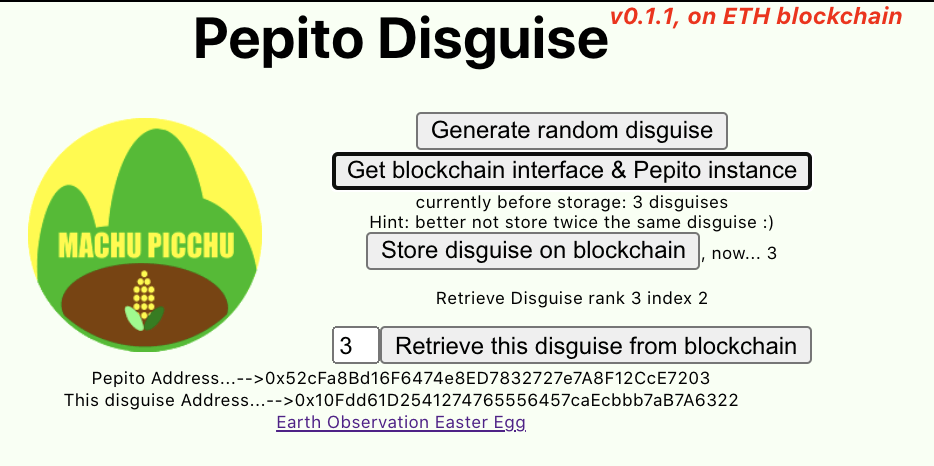

# Presentation
||Pepito is the name of the main character of a [French comic book](https://en.wikipedia.org/wiki/Pepito_(comics)) I loved when I was a kid, in 1960. Pepito was a young corsair of the Caribbean islands. His specialty was his disguises, with which he could fool Hernandez Banana, the Governor of the island of Las Ananas, his favorite (and not very smart) victim. |
|-------|:---------|

In this game, your mission is to build a disguise for Pepito, from [a set of existing components](https://avataaars.com/). Once you built this disguise, you'll record it on the blockchain so that Pepito is sure he'll not reuse it again and will never take twice the same disguise.

Actually, our real purpose in _Machu Picchu_ is to build a blockchain-based tool to manage personal data of persons-in-need worldwide and the financial humanitarian assistance tokens that helper organisations would give to these persons-in-need. These tokens can be exchanged and bundled in a DEX until their owner have enough tokens that it becomes cost-effective to exchange then into fiat money. More info here: [ConsenSys Academy graduation days](https://youtu.be/9fWTD8gf-Us).

In final the win-win situation is
* Helper institutions share the data of the persons-in-need to improve the efficiency of their incentive and aid programs
* Persons-in-need are free to share and exchange their tokens until they decide to make it real fiat money
* Any private of public entity (large or small) who targets these persons can use the data, that are not confiscated by any single actor.

The amount of "Cash Voucher Assistance" (CVA) totalled $5.6bn in 2019, doubling 2016 levels and accounting for 17.9% of total humanitarian assistance. Financial services targeting the same population is 10 times this amount.

## Credits
Big thanks to the following resources:

* [https://avataaars.com/](https://avataaars.com): the initial creator of the images
* [https://github.com/fangpenlin/avataaars](https://github.com/fangpenlin/avataaars): the creator of the React avataar random generator
* [https://github.com/keep-network/random-avatar](https://github.com/keep-network/random-avatar): using avataar to illustrate its own blockchain secure random number generator 

# Demo setup
Last update: April 10, 2021.

## MacOS

* Install [Ganache](https://github.com/trufflesuite/ganache/releases/download/v1.2.1/Ganache-1.2.1-mac.zip) and [Brew](https://brew.sh/)
* Install nodeJS via brew `brew install node@12.18.4` 
* Navigate to the folder where you want to clone the Machu-Picchu project
* Clone the project via `git clone https://github.com/kvutien/Machu-Picchu.git` 
* Install the required packages as follows
  * `cd` to folder `Machu-Picchu/Pepito`, and 
  * run `npm install`
* Rename the file `.env-sample` to `.env` and fill it with your Infura Project Key, and your Metamask seed phrase
* (New, Apr 10) Connect your Metamask to Rinkeby and select an account that has ETH on Rinkeby
* Launch the frontend as follows
  * open another terminal window, `cd` to folder `Machu-Picchu/Pepito`, run the frontend with `npm run start`
  * Your browser will open automatically [http://localhost:3000](http://localhost:3000) to view the app. It may take some time because the frontend is not optimized yet.
  * exercise the functions of the scenario below 

## Suggested demo scenario
* install the dApp as above and run the backend and the frontend as above

* do only once: click on the button "_Get blockchain interface & Pepito instance_"
* click on the button "_Store disguise on blockchain_"
* repeat as many times as desired
  * click on the button "_Generate random disguise_"
  * click on the button "_Store disguise on blockchain_"
* after you have stored more than one disguise, or see more than one disguise on Rinkeby, you may retrieve the stored disguises
  *  click on the text box
  *  give the number of the disguise to retrieve
  *  click on the button "_Retrieve this disguise from blockchain_"

## Truffle test, on local `truffle develop` network
* in folder `Machu-Picchu/Pepito`, run `truffle develop`: it will generate its own ganache-like network
* in `truffle develop>` type `migrate` (or `migrate --reset` to force a new deployment)
* in `truffle develop>` type `test`

## Run demo on local `truffle develop` network
* Once the local testnet of `truffle develop` is running (should be http://127.0.0.1:9545) connect your Metamask to it and import the first `truffle develop` account into Metamask
* In the browser window, reload the frontend and exercise again the scenario above
* _Metamask notes_:
  * if you often use Metamask on this same testnet `truffle develop`, remember to "reset" the account used, to align Metamask's nonce with this fresh blockchain
  * when you store a disguise, Metamask will display one confirmation to create a disguise contract and one confirmation to store the disguise inside this contract. If Metamask displays only one single confirmation dialog, or displays a confirmation dialog with a strange gas limit, you may need to reset your account. See here [https://metamask.zendesk.com/hc/en-us/articles/360015488891-Resetting-an-Account](reset Metamask account)
  * if the gas price in Metamask is too low (<10 gwei) the disguise creation may be unsuccessful in Rinkeby, making the frontend hang. Reload the page and increase the gas price to 20 gwei. A JavaScript `try/catch` will be added in the near future)

# Miscellaneous
## State of the project in this repository, April 2021
* [demo video: https://youtu.be/3nN-B7XjG_U](https://youtu.be/3nN-B7XjG_U) 
* backend working, both on Rinkeby (new) and on `truffle develop`.
  * (new) 13 Mocha contract tests. In `Pepito`, 6 tests passed. In `PepitoDisguise`, 7 tests passed
* frontend operational in `localhost`, external hosting TODO
* git
  * github URL: [https://github.com/kvutien/Machu-Picchu](https://github.com/kvutien/Machu-Picchu)

## Design
[Design Notes & ConsenSys requirements for Final Project](./Design%20notes.md)

## One last thing: versions of the packages successfully used in development and tests
* Truffle v5.1.46 (core: 5.1.46)
* Solidity - 0.6.0 (solc-js set in truffle-config)
* Node v12.18.4
* Web3.js v1.2.1
* @truffle/hdwallet-provider v1.2.3